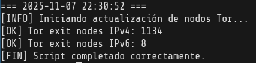

# Bloquear Tor (Tor Exit Nodes Blocker)

## Español

Este script está diseñado para actualizar listas de nodos de salida de Tor (IPv4 e IPv6) y bloquear su tráfico en un servidor usando `ipset` e `iptables`. Está pensado para **administradores de sistemas** que quieran reducir tráfico automatizado o abusivo proveniente de la red Tor.  

**Advertencia:** Este script **no busca afectar la privacidad de los usuarios de Tor de manera general**, sino proteger servidores específicos. Úsalo con responsabilidad.  

### Características

- Bloqueo de nodos de salida Tor (IPv4 + IPv6) en entrada y salida.
- Logging rate-limited de conexiones bloqueadas.
- Limpieza y actualización automática de `ipsets`.
- Fácil de personalizar para tu servidor.

### Requisitos

- Linux con `iptables`, `ipset` y `curl`.
- Permisos de root para aplicar reglas de firewall.

### Uso

1. Copiar el script a `/usr/local/bin/bloquear_tor.sh`.
2. Dar permisos de ejecución:  
    ```bash
    sudo chmod +x /usr/local/bin/bloquear_tor.sh
    ```
3. Ejecutar manualmente o programar en cron:
    ```bash
    sudo /usr/local/bin/bloquear_tor.sh
    ```
> Nota: Se ha comentado la parte de envío de correo para evitar configuración adicional. Si deseas usarlo, puedes configurar msmtp y descomentar la sección correspondiente.



## English

This script is designed to update Tor exit node lists (IPv4 and IPv6) and block their traffic on a server using ipset and iptables. It is intended for system administrators who want to reduce automated or abusive traffic coming from the Tor network.

**Warning:** This script does not aim to affect Tor users’ privacy in general, only to protect specific servers. Use responsibly.
### Features

- Blocks Tor exit nodes (IPv4 + IPv6) on incoming and outgoing traffic.
- Rate-limited logging of blocked connections.
- Automatic cleanup and update of ipsets.
- Easy to customize for your server.

### Requirements

- Linux with iptables, ipset, and curl.
- Root permissions to apply firewall rules.

### Usage

1. Copy the script to /usr/local/bin/bloquear_tor.sh.

2. Make it executable:
    ```bash
    sudo chmod +x /usr/local/bin/bloquear_tor.sh
    ```
3. Run manually or schedule with cron:
    ```bash
    sudo /usr/local/bin/bloquear_tor.sh
    ```
> Note: The email sending section has been commented out to avoid extra configuration. If desired, you can configure msmtp and uncomment that section.


